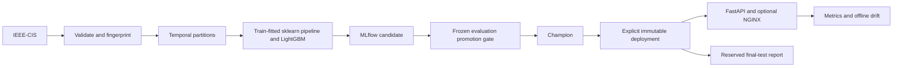

# End-to-end MLOps for IEEE-CIS fraud detection

A reproducible fraud-model release with a shared training/serving pipeline, leakage-safe temporal evaluation, gated MLflow promotion, explicit immutable deployment, and validated FastAPI inference. Built with Python, pandas, scikit-learn, LightGBM, MLflow, FastAPI, Docker, NGINX and GitHub Actions.

## Canonical real-data result

**REAL IEEE-CIS EVIDENCE — `ieee-cis-v1`** uses all 590,540 labelled transactions across training and reserved evaluation partitions. The frozen ordinal/drop, uncalibrated baseline was selected before final reporting. One explicit report scored 88,581 future holdout transactions at the validation-selected threshold `0.1508937436017237`.

| Final temporal holdout metric | Value |
|---|---:|
| PR-AUC (average precision) | 0.522978 |
| ROC-AUC | 0.895626 |
| Precision | 0.442990 |
| Recall | 0.526760 |
| F1 | 0.481256 |
| Fraud prevalence | 3.480430% |
| Rows | 88,581 |

Confusion counts: TN 83,456; FP 2,042; FN 1,459; TP 1,624. These are historical dataset results, not claimed live-service performance. [Exact metrics](releases/ieee-cis-v1/final_test_metrics.json), [model card](docs/model-card.md), [safe release manifest](releases/ieee-cis-v1/release_manifest.json).

Run `a7d516e70f714caeb67f35bd2c30762f`; registered/champion/deployed version `1` in the isolated canonical registry. Dataset fingerprint `a01f77eaa792c8346a876102fa3c717f7361ccd4e14fe1a57735b86816c7ab75`. Raw data and model binaries are private local artifacts, not redistributed.

## Architecture



Training and inference use the same fitted preprocessing/model object. [Architecture details](docs/architecture.md).

## MLOps lifecycle safeguards

- Train-only schema inference, imputation and encoding; distinct early-stopping, threshold-selection, promotion and final-test partitions.
- Training assigns only `candidate`. Promotion independently verifies frozen artifact bytes/semantic identities and rescoring at each model's own threshold, then records the decision before moving `champion`.
- Deployment separately records immutable version/run/history. API startup loads `models:/<name>/<version>`; alias changes do not silently update serving. Rollback restores recorded deployments.
- Configuration, file hashes and split identities are committed before final-test scoring. The final holdout reports one frozen release and does not select models or thresholds.
- Synthetic fixtures validate plumbing only and never represent IEEE-CIS quality.

## Reproduce the canonical release

Obtain legitimate IEEE-CIS Kaggle access and place the four original CSVs in ignored `data/processed/ieee-fraud-detection/`. Follow the [canonical reproduction guide](docs/canonical-release.md) for frozen configuration, tracking setup, training, promotion, deployment, API checks and explicit final reporting. Full-data execution requires `SAMPLE_ROWS=0`; the default 300,000-row quickstart is sampled evidence.

Verify published safe identities without access to private rows:

```bash
python -m venv .venv
source .venv/bin/activate
pip install -r requirements-dev.txt
python -m scripts.verify_canonical_release
```

## Serving and API

`GET /health` reports liveness; `GET /ready` reports immutable model version/run identity or 503. `POST /predict` returns probability, binary decision and the stored threshold for single/batch requests. `GET /metrics` exposes Prometheus metrics.

```bash
curl -s http://127.0.0.1:8000/ready
curl -s http://127.0.0.1:8000/predict \
  -H 'Content-Type: application/json' \
  -d '{"records":[{"TransactionAmt":100.0}]}'
```

Each record requires at least one non-missing recognized usable model feature. No particular feature is mandatory. Omitted features follow fitted imputation; unknown extra fields are ignored when a usable feature exists. Numeric features accept finite numbers/numeric strings, categorical features nonblank strings, and null denotes missing. Empty/all-null/unknown-only records, booleans, nested values and invalid feature types return 422. Default batch/body limits are 500 records and 2 MB. Optional API-key authentication and NGINX rate limits are configurable. [API contract](docs/api.md), [deployment and rollback](docs/deployment.md).

## Monitoring and security

Offline drift reports use reference-derived bins, bounded category buckets and reproducible fingerprints. Runtime metrics and redacted structured request logs are implemented. Delayed-label performance monitoring, persisted prediction logs and alert integration remain deferred. [Monitoring guide](docs/monitoring.md).

Serving images use digest-pinned public Wolfi/Python 3.11.17 and 38 locked OS packages. Authoritative Phase 5 evidence: zero OS HIGH/CRITICAL findings; **22 accepted Python residual findings per image**, including 8 CRITICAL, expiring 2026-11-01. Accepted risk is not remediation or vulnerability-free operation. Gitleaks, Trivy, SPDX SBOMs, exact OS inventory coverage and runtime compatibility checks are documented in [project state](docs/PROJECT_STATE.md) and [security decision](docs/security/runtime-strategy.md).

## Local development: SYNTHETIC SMOKE / PLUMBING EVIDENCE

```bash
source .venv/bin/activate
mkdir -p artifacts/local-smoke
export MLFLOW_TRACKING_URI="sqlite:///artifacts/local-smoke/mlflow.db"
export DEPLOYMENT_STATE_PATH="artifacts/local-smoke/deployment/current.json"
python -m src.modeling.train --data-source synthetic --n-synthetic 6000
python -m src.registry.promote
python -m src.deployment.lifecycle deploy
python -m uvicorn src.api.app:app --host 127.0.0.1 --port 8000
```

Use a separate store from the real canonical release. The isolated CI/local validator `python scripts/validate_e2e.py` performs synthetic training → promotion → deployment → API checks. Its scores are smoke evidence only.

```bash
pytest tests/unit -q
pytest tests/integration -q
pytest -q
pytest --cov=src --cov-report=term-missing --cov-fail-under=75
ruff check src tests scripts
black --check src tests scripts
mypy src
make security-audit
```

## Limitations

The final threshold misses 47.3% of holdout fraud and flags 2,042 legitimate transactions; operational review and domain validation are needed. No subgroup fairness, current-traffic evaluation or cloud production SLA is claimed. Canonical model execution used macOS arm64 Python 3.11.15; container compatibility checks cover Linux amd64 synthetic artifacts. Reproduction can vary numerically across architectures and parallel implementations.

Production-like Compose defines Postgres/MinIO/S3/MLflow/API/NGINX, but complete stack E2E remains limited by the obsolete archived Community MinIO image distribution. No object-store replacement was introduced and no complete production-stack PASS is claimed. Restricted data and canonical model artifacts remain local, so reproducing them requires permitted access and training.

## Project structure

| Path | Purpose |
|---|---|
| `src/data/`, `src/features/` | Ingestion, validation and train-fitted preprocessing |
| `src/modeling/` | Temporal evaluation, LightGBM, optional calibration, final report |
| `src/registry/`, `src/deployment/` | Independent promotion and immutable deployment |
| `src/api/`, `src/monitoring/` | HTTP inference, metrics and offline drift |
| `scripts/` | Release identity, lifecycle and security validators |
| `releases/ieee-cis-v1/` | Safe canonical configuration and evidence |
| `docs/` | Model card, architecture, reproduction and project state |
| `tests/`, `.github/workflows/` | Regressions, CI and security evidence |


## Explicit Phase 6 completion exception — 2026-10-02

**Production-like E2E = NOT VERIFIED.** Reason: **unavailable legacy Community
MinIO container distribution**; existing `minio/minio` repository/image is
unavailable/access denied. Workflow `37009722147` is preserved as failed
evidence. This is an external infrastructure limitation. The user explicitly
authorized Phase 6 closure with this limitation retained; the exception does
not mark that workflow PASS or establish production readiness for the full stack.
Local-lite real IEEE-CIS lifecycle is verified; canonical release evidence
remains valid. No MinIO replacement, AIStor substitution, infrastructure redesign,
validator weakening, model/evaluation change or final-test selection rerun is
authorized by this exception.
