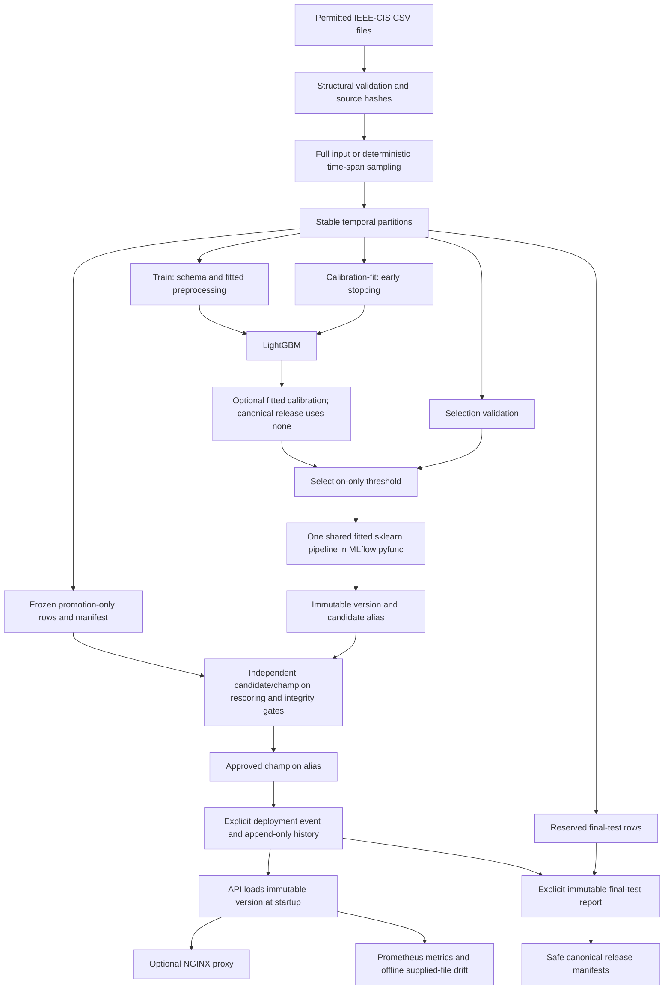

# Architecture

## Data and evaluation

`src/data/ingest.py`, `sampling.py` and `validation.py` load and structurally validate transactions, then left-join unique identity records. Full-data canonical execution sets `SAMPLE_ROWS=0`; quickstart sampling is a separate deterministic, time-span-preserving mode. Competition test CSVs lack targets and are distinct from the final temporal holdout of labelled training data.

`src/modeling/validation.py` reserves the latest 15% for final reporting. The earliest 70% fits schema/preprocessing/model. The middle 15% becomes 3.75% early-stopping/calibration-fit, 3.75% threshold/variant selection, and 7.5% promotion evaluation (rounded row counts). Split helpers preserve stable temporal order. Canonical exact counts/boundaries/hashes are published in [release evidence](../releases/ieee-cis-v1/split_manifest.json).

## Shared fitted pipeline

Train-only `infer_schema`, `ColumnAligner.fit`, imputation and encoding produce one fitted sklearn pipeline. Its classifier step contains either LightGBM or the serialized optional probability calibrator. Canonical IEEE-CIS v1 preserves ordinal/drop encoding and no calibration. The pyfunc wrapper computes probability and binary decision using the stored selection threshold.

The API unwraps the MLflow wrapper and validates transport and feature semantics using its authoritative feature schema before calling the same pipeline. Numeric coercion and alignment are pipeline operations; there is no separate serving transform. Optional signature columns do not broaden the HTTP contract: each record must contain at least one non-missing recognized usable feature. Finite numeric values/numeric strings and nonblank categorical strings are accepted; booleans, nested values, invalid numeric values and empty/all-missing/unknown-only records are rejected.

## Registry intent and deployment state

Training registers an immutable version and assigns only `candidate`. Frozen promotion Parquet is private; its safe manifest records exact-row identity, source identity, target distribution, time boundaries and its own byte checksum. `src/registry/compare.py` validates each artifact independently, reconciles semantic identities and exact rows, and rescoring uses each immutable model's own stored threshold. `promote.py` enforces absolute/regression quality gates and candidate alias stability, persisting the decision trace before moving `champion`. Missing, inconsistent or incomparable evidence blocks promotion.

`src/deployment/lifecycle.py` independently verifies the approved version/run and champion immediately before persisting an append-only deployment event and replacing current state atomically. API startup reads that state and loads `models:/<name>/<version>`; aliases and legacy stages are not serving targets. Promotion does not reload or deploy. Rollback restores recorded deployment history without moving the champion alias; process recreation is explicit.

## Storage and runtime

Local-lite uses SQLite and local artifact storage; direct Python API execution requires no Docker daemon. The production-like profile defines Postgres, Community MinIO/S3, MLflow, API and NGINX with private internal service networking. Its archived Community MinIO image distribution remains a documented external limitation; this diagram is not a claim that the complete stack passed E2E.

API and MLflow containers use digest-pinned public Wolfi, Python 3.11.17, identical locked native packages and constrained application dependencies. Security evidence reconciles Trivy/Syft OS inventories, scans exact images and reachable Git history, checks native/serialization/server/API compatibility and publishes SPDX SBOMs. The 22 reviewed Python residuals per image remain accepted risk. See [runtime decision](security/runtime-strategy.md).

## Monitoring and release traceability

Request middleware provides bounded bodies, optional API-key authentication, request IDs, redacted structured logging and Prometheus counters. Offline drift uses reference-derived bins, bounded categories, deterministic metrics and supplied provenance. Live prediction logging, delayed-label performance monitoring and alerts remain deferred.

Canonical release traceability is: raw file SHA-256 → dataset fingerprint → split fingerprints → committed config → training commit/run → immutable model version → candidate → frozen promotion gate → champion → deployment event/history → immutable readiness → single explicit final-test report → safe release manifest → annotated `ieee-cis-v1` tag (`243212ce211ceedb02e7230a53f4017b33d3decb`). [Reproduction guide](canonical-release.md) gives executable commands; `scripts.verify_canonical_release` rejects mismatched identities. Private artifacts are retained locally and are not GitHub release attachments.

## Module map

| Module | Responsibility |
|---|---|
| `src/config.py` | Settings and project-relative paths |
| `src/data/` | Ingestion, sampling and validation |
| `src/features/pipeline.py` | Shared fitted preprocessing |
| `src/modeling/` | Splits, experiments, calibration, threshold, training, final reporting |
| `src/registry/` | Comparable rescoring and explicit promotion |
| `src/deployment/` | Immutable deployment/rollback history |
| `src/api/` | Validated HTTP inference, health/readiness, metrics |
| `src/monitoring/` | Offline deterministic drift |
| `scripts/canonical_release.py` | Source audit and preregistration |
| `scripts/verify_canonical_release.py` | Safe release identity checks |
| `releases/ieee-cis-v1/` | Safe metadata only |
